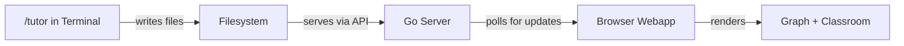

## Welcome to Knowtree

Knowtree is a self-directed learning system built around three components that work together: a Socratic tutor in your terminal, a Go server that manages state, and a browser webapp that visualizes your progress.

Let's map out how these pieces fit together.

### Architecture

The key insight is that the tutor and the browser never talk directly. The filesystem is the communication layer — the tutor writes Markdown and JSON files, the server reads them, and the webapp polls the server for changes.

### The Three Pillars

| Component | Where It Runs | What It Does |
|-----------|--------------|--------------|
| **Tutor** | Terminal (Claude Code) | Teaches via Socratic dialogue, writes classroom content and progress |
| **Server** | localhost:3000 | Serves static files, provides JSON API over the filesystem |
| **Webapp** | Browser | Visualizes knowledge graphs, renders classroom content, shows plots |

### Getting Started

1. Start the server: `go run server/main.go`
2. Open `http://localhost:3000` in your browser
3. Select a knowledge graph from the graph selector
4. Click an available node to preview it
5. Run `/tutor` in Claude Code to start learning

---

## Test Results

**Final Test Score: 92%**

| # | Topic | Result |
|---|-------|--------|
| 1 | Architecture Overview | Correct |
| 2 | Communication Flow | Correct |
| 3 | Terminal vs Browser Roles | Correct |
| 4 | Server Purpose | Incorrect — confused API endpoints with WebSocket connections |
| 5 | Getting Started Steps | Correct |
