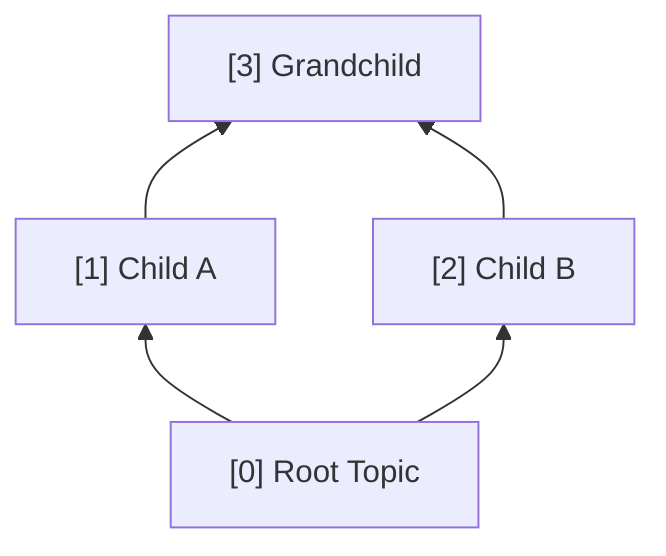

## The Graph View

The graph view is the primary navigation interface in Knowtree. It renders your knowledge graph as a directed acyclic graph (DAG) using D3.js for rendering and dagre for automatic layout.

### How the DAG Works

Nodes flow bottom-to-top: prerequisites are at the bottom, advanced topics at the top. Edges represent "unlocks" relationships — completing a parent node makes its children available.

### Node Status Colors

| Status | Color | Meaning |
|--------|-------|---------|
| **Completed** | Green | All subconcepts mastered, assessment passed |
| **In Progress** | Blue | Tutor session started, currently learning |
| **Available** | Orange | All prerequisites met, ready to start |
| **Locked** | Grey | Prerequisites not yet completed |
| **Error** | Red | Parse error in the node's content file |

### Interaction

- **Single click** — Select a node, show its details in the sidebar
- **Double click** — Open the node (if available or in-progress)
- **Scroll** — Zoom in and out
- **Drag** — Pan the view
- **F key** — Fit the entire graph to screen

> **Pro tip:** Double-click on empty space to reset the zoom and fit the entire graph into view. This is especially useful after zooming into a dense region of the graph.

### Navigation

Press `Escape` to go back one level: from classroom to graph view, or from graph view to the graph selector. The current path is always shown in the header breadcrumb.

---

## Test Results

**Final Test Score: 95%**

| # | Topic | Result |
|---|-------|--------|
| 1 | DAG Layout Direction | Correct |
| 2 | Node Status Colors | Correct |
| 3 | Click vs Double-Click | Correct |
| 4 | Zoom and Pan | Correct |
| 5 | Back Navigation | Incorrect — said Enter instead of Escape |
| 6 | Prerequisite Unlocking | Correct |
