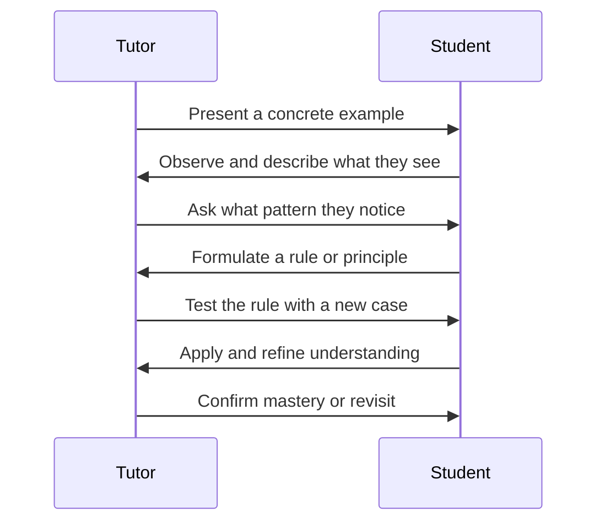

## The Socratic Tutor

The tutor is the teaching engine of Knowtree. Instead of presenting information as a lecture, it uses the Socratic method — guiding you to discover concepts through carefully sequenced questions and examples.

### The Socratic Flow



The tutor never gives answers directly. It provides examples, asks questions, and lets you build understanding from the ground up.

### Example Terminal Exchange

```
Tutor: Look at this knowledge graph structure:

  [0] Root → [1] Child A
  [0] Root → [2] Child B
  [1] Child A → [3] Grandchild
  [2] Child B → [3] Grandchild

  If nodes 0 and 1 are completed but node 2 is not,
  what status would node 3 have?

You:  Locked — because node 2 isn't completed yet,
      and node 3 requires ALL parents to be done.

Tutor: Exactly right. The rule is that a node unlocks
       only when every parent is completed.
```

### Tutor Phases

| Phase | What Happens | State Written |
|-------|-------------|---------------|
| **Startup** | Tutor reads the node content, generates subconcepts | `progress.json` created |
| **Teaching** | Socratic dialogue through each subconcept | `classroom.md` updated live |
| **Assessment** | Short test over all subconcepts | Test results appended to `classroom.md` |
| **Completion** | Score evaluated, node marked completed if passed | `progress.json` status updated |

### Live Updates

As the tutor writes to `classroom.md` during a session, the browser webapp polls the server every few seconds and re-renders the content. You see diagrams, tables, and explanations appear in the classroom panel in near real-time.

---

## Test Results

**Final Test Score: 90%**

| # | Topic | Result |
|---|-------|--------|
| 1 | Socratic Method Principles | Correct |
| 2 | Subconcept Breakdown | Correct |
| 3 | Session Lifecycle | Correct |
| 4 | Live Update Mechanism | Incorrect — said WebSockets instead of polling |
| 5 | Progress Tracking | Correct |
| 6 | Classroom.md Role | Correct |
