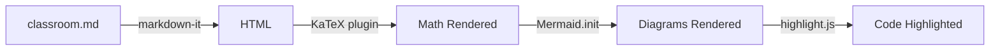

## The Classroom View

The classroom is the rendering engine of Knowtree's browser interface. It takes the Markdown content written by the tutor and renders it as rich, interactive content using several specialized libraries.

### Supported Content Types

| Feature | Library | Syntax |
|---------|---------|--------|
| **Markdown** | markdown-it | Standard CommonMark |
| **Math** | KaTeX | `$inline$` and `$$display$$` |
| **Diagrams** | Mermaid | ` ```mermaid ` fenced blocks |
| **Code** | highlight.js | ` ```language ` fenced blocks |
| **Charts** | Plotly.js | `active-plot.json` in state dir |

### Math Rendering

The classroom supports LaTeX math via KaTeX. You can write inline math like $E = mc^2$ or display equations:

$$\sum_{i=1}^{n} x_i = x_1 + x_2 + \cdots + x_n$$

The quadratic formula, for example:

$$x = \frac{-b \pm \sqrt{b^2 - 4ac}}{2a}$$

### Rendering Pipeline



### Code Block Example

Here's what a syntax-highlighted code block looks like — this is the actual Go handler that serves classroom content:

```go
func handleClassroom(w http.ResponseWriter, graphID string) {
    state := readActiveState()
    nodeID := state.NodeID
    path := filepath.Join(contentDir(), graphID,
        ".state", nodeID, "classroom.md")
    data, _ := os.ReadFile(path)
    writeJSON(w, map[string]string{
        "content": string(data),
        "nodeId":  nodeID,
    })
}
```

### The Graph Panel

Beyond Markdown content, the tutor can create interactive Plotly charts by writing an `active-plot.json` file. The webapp detects this and renders a full Plotly chart in a dedicated panel — supporting scatter plots, bar charts, Sankey diagrams, and more. Check the graph panel now to see a live example.

---

## Session In Progress

Completed 2 of 6 subconcepts. Remaining:
- Mermaid diagrams: flowcharts, sequence diagrams, and more
- Syntax-highlighted code blocks
- Tables and blockquote formatting
- The graph panel: interactive Plotly charts
