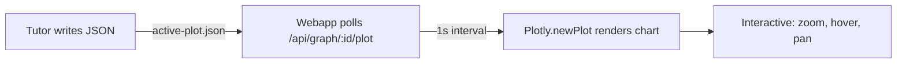

## The Graph Panel

The graph panel is Knowtree's interactive visualization layer, powered by Plotly.js. When the tutor writes an `active-plot.json` file, the webapp renders it as a fully interactive chart you can zoom, pan, and hover.

### How It Works



### File Location

Plot files are written per-node:

```
content/<graph>/.state/<nodeId>/active-plot.json
```

The webapp automatically detects new or updated plots and re-renders. If the panel is closed when a plot arrives, the tab pulses orange to alert you.

### JSON Structure

Every plot file follows Plotly's schema:

```json
{
  "data": [
    {
      "type": "scatter",
      "mode": "markers+text",
      "x": [1, 2, 3],
      "y": [4, 5, 6],
      "marker": { "color": "#e8a034" },
      "name": "My Trace"
    }
  ],
  "layout": {
    "title": { "text": "Chart Title" },
    "plot_bgcolor": "#262626",
    "paper_bgcolor": "#1e1e1e"
  }
}
```

### Theme Colors

All plots use Knowtree's dark theme palette:

| Role | Color | Hex |
|------|-------|-----|
| Background (plot) | Dark grey | `#262626` |
| Background (paper) | Darker grey | `#1e1e1e` |
| Grid / axes | Mid grey | `#555` |
| Text | Light grey | `#dadada` |
| **Primary accent** | Orange | `#e8a034` |
| **Secondary accent** | Blue | `#4a9eff` |
| **Highlight** | Green | `#4caf50` |
| **Error / alert** | Red | `#ef4444` |

### What's In The Panel Right Now

The current plot shows **powers of $z = 1 + i$** on the complex plane — a demonstration of how complex multiplication combines rotation and scaling:

| Power | Value | Magnitude | Angle |
|-------|-------|-----------|-------|
| $z$ | $1 + i$ | $\sqrt{2}$ | $45°$ |
| $z^2$ | $2i$ | $2$ | $90°$ |
| $z^3$ | $-2 + 2i$ | $2\sqrt{2}$ | $135°$ |
| $z^4$ | $-4$ | $4$ | $180°$ |

Each successive power rotates by $45°$ and scales the magnitude by $\sqrt{2}$. Hover over the points in the graph panel to see the polar coordinates.

### Supported Chart Types

Plotly supports a wide range of visualizations:

- **Scatter / Line** — plotting points, functions, vectors
- **Bar** — comparing quantities, histograms
- **Heatmap** — 2D data, matrices
- **Sankey** — flow diagrams
- **3D Surface** — three-dimensional functions
- **Animations** — step-by-step demonstrations via Plotly frames

The tutor selects the right visualization for each concept and writes it to `active-plot.json` during the lesson.
